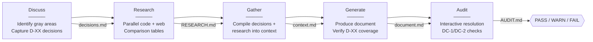
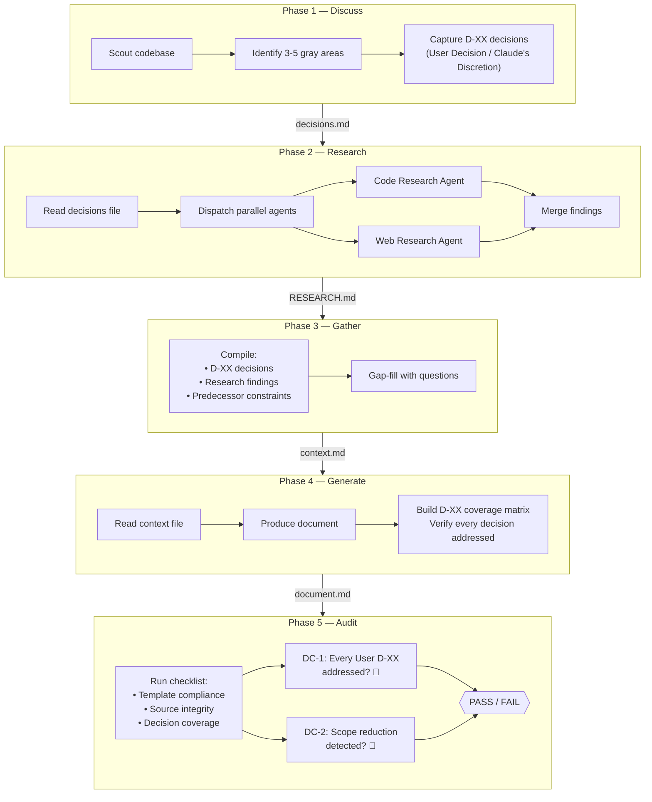
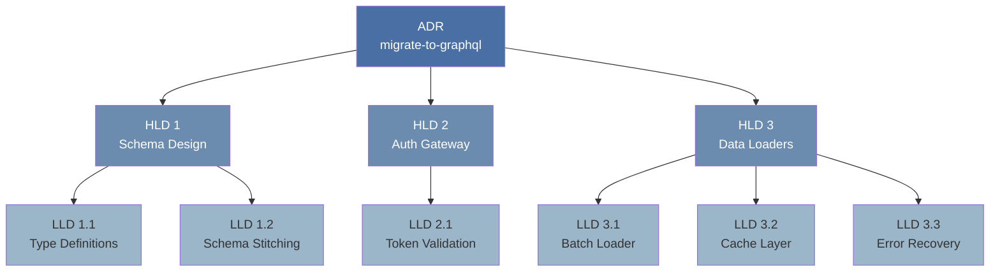
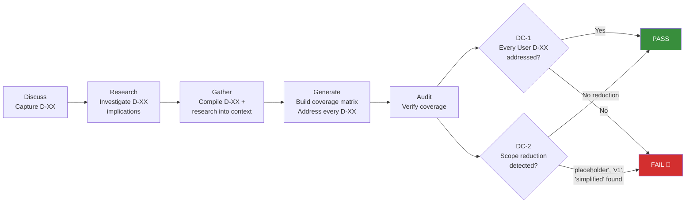
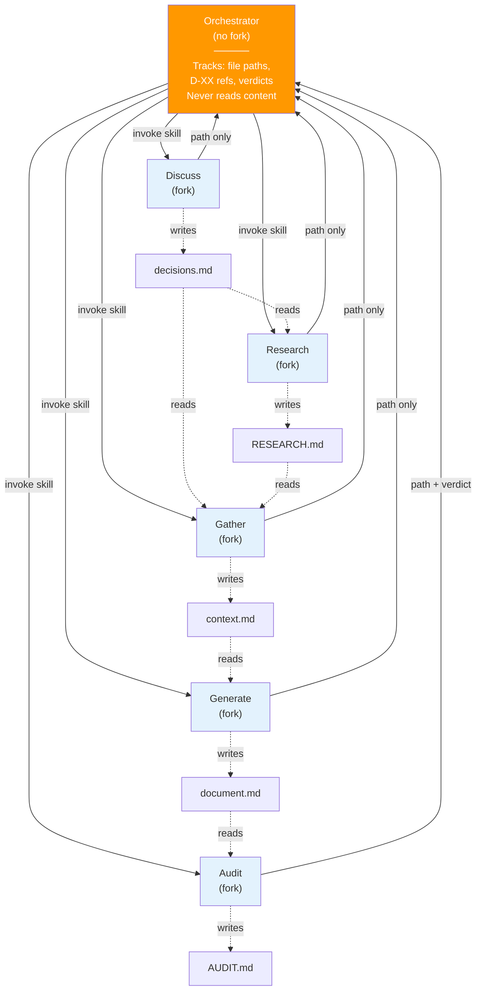
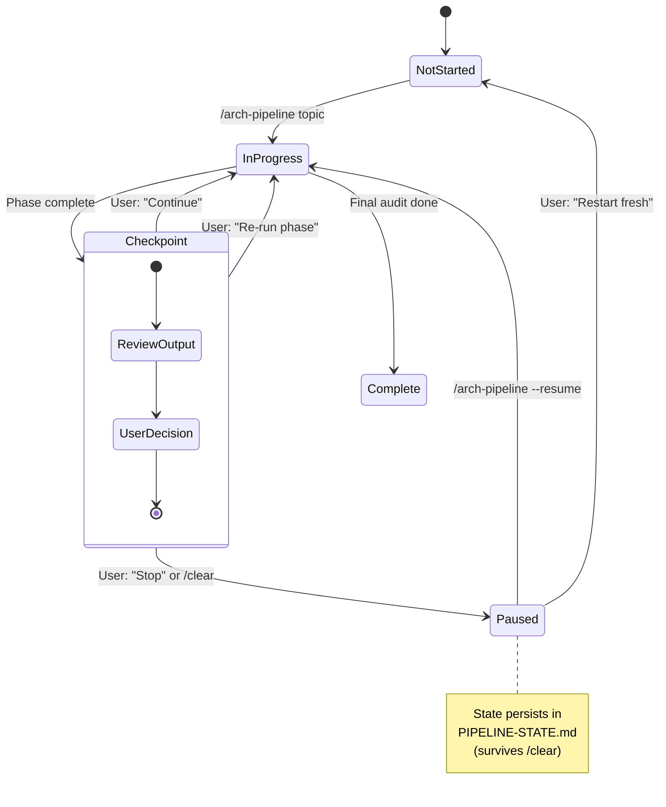

# Architecture Docs Plugin

ADR → HLD → LLD pipeline with 5-phase cycle per document type: discuss → research → gather → generate → audit. Features D-XX decision tracking, cross-session state persistence, goal-backward verification, and context-clearing prompts between major transitions.

## Installation

```bash
/plugin install architecture-docs@bt-web-sdk-marketplace
```

## Skills

### Full Pipeline

| Skill | Command | Description |
|-------|---------|-------------|
| **Pipeline** | `/architecture-docs:arch-pipeline [topic]` | Run the full pipeline: ADR → HLD(s) → LLD(s), each with discuss → research → gather → generate → audit. Supports `--resume` for cross-session continuity. |

### Discuss (Gray Area Identification)

| Skill | Command | Description |
|-------|---------|-------------|
| **ADR Discuss** | `/architecture-docs:adr-discuss [topic]` | Scout codebase, identify 3-5 gray areas, capture D-XX numbered decisions for ADR. |
| **HLD Discuss** | `/architecture-docs:hld-discuss [topic] [--adr path]` | Architecture-level gray areas: component boundaries, integration patterns, data ownership. |
| **LLD Discuss** | `/architecture-docs:lld-discuss [topic] [--hld path]` | Implementation-level gray areas: interfaces, error handling, state management, testing. |

### Research

| Skill | Command | Description |
|-------|---------|-------------|
| **Arch Research** | `/architecture-docs:arch-research [decisions-file]` | Standalone research phase. Reads decisions, dispatches parallel code+web research, produces RESEARCH.md with comparison tables. |
| **Code Research** | `/architecture-docs:code-research [question]` | Codebase investigation with tabular output: patterns, reusable assets, gap analysis. |
| **Web Research** | `/architecture-docs:web-research [question]` | External research with approach comparison, don't-hand-roll warnings, confidence-tiered sources. |

### ADR (Architecture Decision Records)

| Skill | Command | Description |
|-------|---------|-------------|
| **ADR Gather** | `/architecture-docs:adr-gather [decisions-file] [--research path]` | Compiler mode: merges decisions + research into context file. Also supports standalone Q&A. |
| **ADR Generate** | `/architecture-docs:adr-generate [context-file]` | Generate MADR 4.0.0 ADR with D-XX decision coverage verification. |
| **ADR Audit** | `/architecture-docs:audit-adr [adr-path] [--context path]` | Audit for compliance, integrity, consistency, and decision coverage. Interactive resolution. |

### HLD (High Level Design)

| Skill | Command | Description |
|-------|---------|-------------|
| **HLD Gather** | `/architecture-docs:hld-gather [decisions-file] [--adr path] [--research path]` | Compiler mode: merges decisions + research + ADR constraints into context file. |
| **HLD Generate** | `/architecture-docs:hld-generate [context-file] [--adr path]` | Generate HLD with D-XX decision coverage verification. |
| **HLD Audit** | `/architecture-docs:audit-hld [hld-path] [--context path] [--adr path]` | Audit for completeness, ADR alignment, architecture quality, and decision coverage. |

### LLD (Low Level Design)

| Skill | Command | Description |
|-------|---------|-------------|
| **LLD Gather** | `/architecture-docs:lld-gather [decisions-file] [--hld path] [--research path]` | Compiler mode: merges decisions + research + HLD constraints into context file. |
| **LLD Generate** | `/architecture-docs:lld-generate [context-file] [--hld path]` | Generate LLD with D-XX decision coverage verification. |
| **LLD Audit** | `/architecture-docs:audit-lld [lld-path] [--context path] [--hld path]` | Audit for implementation readiness, HLD alignment, and decision coverage. |

### Review & Implementation

| Skill | Command | Description |
|-------|---------|-------------|
| **Doc Review** | `/architecture-docs:doc-review [PR number] [--resume]` | PR-aware document review with grey area analysis (R-XX decisions), resolved/unresolved tracking, REVIEW.md state persistence, and resume capability. |
| **Implement** | `/architecture-docs:implement [path] [--resume]` | Phased implementation with goal-backward verification (T-XX/A-XX/L-XX must-haves) and anti-pattern tracking. |

### Ticket Extraction

| Skill | Command | Description |
|-------|---------|-------------|
| **Jira Tickets** | `/architecture-docs:jira-tickets [path] [--epic PROJ-123]` | Extract actionable items from ADR/HLD/LLD into Jira tickets under a specified epic. Detects document type, applies section-specific extraction rules, drafts tickets for human review before creation, links dependencies, and writes a ticket manifest. All tickets created unassigned. |

## Pipeline Architecture

```
/architecture-docs:arch-pipeline "migrate from REST to GraphQL"
  │
  ├─ Phase 1:  adr-discuss       → docs/context/decisions/<name>-decisions.md
  ├─ Phase 2:  arch-research     → docs/context/decisions/<name>-RESEARCH.md
  ├─ Phase 3:  adr-gather        → docs/context/decisions/<name>-context.md
  │    CHECKPOINT: User reviews context file
  ├─ Phase 4:  adr-generate      → docs/decisions/<name>.md
  ├─ Phase 5:  audit-adr         → interactive resolution → AUDIT.md
  │
  │  *** Context Clear Prompt — pipeline state saved, safe to /clear ***
  │
  │  CHECKPOINT: HLD Scoping (1 or N HLDs)
  │
  ├─ Phase 6:  hld-discuss       → docs/context/hld/<name>-decisions.md
  ├─ Phase 7:  arch-research     → docs/context/hld/<name>-RESEARCH.md
  ├─ Phase 8:  hld-gather        → docs/context/hld/<name>-context.md
  │    CHECKPOINT: User reviews context file
  ├─ Phase 9:  hld-generate      → docs/hld/<name>.md
  ├─ Phase 10: audit-hld         → interactive resolution → AUDIT.md
  │
  │  *** Context Clear Prompt ***
  │
  │  CHECKPOINT: LLD Scoping (1 or M LLDs per HLD)
  │
  ├─ Phase 11: lld-discuss       → docs/context/lld/<name>-decisions.md
  ├─ Phase 12: arch-research     → docs/context/lld/<name>-RESEARCH.md
  ├─ Phase 13: lld-gather        → docs/context/lld/<name>-context.md
  │    CHECKPOINT: User reviews context file
  ├─ Phase 14: lld-generate      → docs/lld/<name>.md
  └─ Phase 15: audit-lld         → interactive resolution → AUDIT.md
```

Every phase runs with `context: fork` — clean context, no accumulated history. Only file paths and verdicts pass between phases.

### Pipeline Flow

The full pipeline progresses through three document tiers, with checkpoints and context clears between them:

```mermaid
flowchart TD
    Start(["/arch-pipeline topic"]) --> D1[ADR Discuss]
    D1 --> R1[ADR Research]
    R1 --> G1[ADR Gather]
    G1 --> CP1{{"CHECKPOINT\nReview context file"}}
    CP1 --> Gen1[ADR Generate]
    Gen1 --> A1[ADR Audit]
    A1 --> CC1[/"Context Clear Prompt\nState saved — safe to /clear"/]

    CC1 --> Scope1{{"HLD Scoping\n1 or N HLDs?"}}
    Scope1 --> HLD_LOOP["FOR EACH HLD [i]"]
    HLD_LOOP --> D2[HLD Discuss]
    D2 --> R2[HLD Research]
    R2 --> G2[HLD Gather]
    G2 --> CP2{{"CHECKPOINT\nReview context file"}}
    CP2 --> Gen2[HLD Generate]
    Gen2 --> A2[HLD Audit]
    A2 --> CC2[/"Context Clear Prompt"/]

    CC2 --> Scope2{{"LLD Scoping\n1 or M LLDs?"}}
    Scope2 --> LLD_LOOP["FOR EACH LLD [j]"]
    LLD_LOOP --> D3[LLD Discuss]
    D3 --> R3[LLD Research]
    R3 --> G3[LLD Gather]
    G3 --> CP3{{"CHECKPOINT\nReview context file"}}
    CP3 --> Gen3[LLD Generate]
    Gen3 --> A3[LLD Audit]
    A3 --> MORE_LLD{More LLDs?}
    MORE_LLD -->|Yes| LLD_LOOP
    MORE_LLD -->|No| MORE_HLD{More HLDs?}
    MORE_HLD -->|Yes| HLD_LOOP
    MORE_HLD -->|No| Done([Pipeline Complete])

    Done -.-> Impl["/implement"]
    Done -.-> Jira["/jira-tickets"]

    style CC1 fill:#f9f,stroke:#333
    style CC2 fill:#f9f,stroke:#333
    style CP1 fill:#ffd,stroke:#333
    style CP2 fill:#ffd,stroke:#333
    style CP3 fill:#ffd,stroke:#333
```



### 5-Phase Cycle

Every document type (ADR, HLD, LLD) follows the same 5-phase cycle. This is the repeating unit of the pipeline:



### Data Flow

How artifacts flow between phases, showing parallel research dispatch and decision coverage verification:



### 1:N:M Fan-Out

One ADR can produce multiple HLDs (one per subsystem), and each HLD can produce multiple LLDs (one per component):



Total phases: **5 + 5N + 5NM** (where N = number of HLDs, M = LLDs per HLD). In this example: 5 + 5(3) + 5(2+1+3) = **50 phases**.

### Decision Tracking Lifecycle

D-XX decisions are captured in Discuss and verified as contracts through every downstream phase:



### Context Isolation Model

The orchestrator never holds document content — each phase runs in its own forked context and communicates only via files:



### Context Isolation

| Phase Type | Fork? | Why |
|------------|-------|-----|
| Discuss | Yes | Gray area identification + decision capture in clean context. |
| Research | Yes | Parallel code+web research producing structured RESEARCH.md. |
| Gather | Yes | Compiles decisions + research into context file. Gap-fills only missing areas. |
| Generate | Yes | Non-interactive. Reads context file, produces document, verifies D-XX coverage. |
| Audit | Yes | Interactive resolution loop with decision coverage checks. |
| Orchestrator | No | Tracks file paths, decisions, and verdicts. Never reads document content. |

## Workflow Guides

Step-by-step guides for common scenarios. Each workflow is self-contained — expand the one that matches your use case.

<details>
<summary><strong>Full Pipeline (End-to-End)</strong></summary>

Run the complete ADR → HLD(s) → LLD(s) pipeline with all checkpoints and context isolation.

```bash
/architecture-docs:arch-pipeline "migrate payment processing to event-driven architecture"
```

**What happens at each stage:**

1. **ADR Discuss** — Claude scouts the codebase (~10 tool calls), identifies 3-5 gray areas specific to your topic, and captures each as a D-XX decision. You'll be asked to classify decisions as "User Decision" (you choose) or "Claude's Discretion" (Claude chooses).

2. **ADR Research** — Parallel code + web research agents investigate the D-XX decisions. Produces `RESEARCH.md` with comparison tables, don't-hand-roll warnings, and common pitfalls.

3. **ADR Gather** — Compiles decisions + research into a single context file. Asks targeted gap-fill questions for anything missing. **CHECKPOINT: You review the context file before proceeding.**

4. **ADR Generate** — Non-interactive. Reads context file, produces a MADR 4.0.0 ADR, and builds an internal coverage matrix verifying every D-XX is addressed.

5. **ADR Audit** — Interactive issue walk-through. Each issue offers: recommended fix, alternative fix, research deeper, or skip. Verdict: PASS / PASS WITH WARNINGS / FAIL. DC-1/DC-2 checks are CRITICAL — skipping them produces FAIL.

6. **Context Clear** — Pipeline state is saved to `PIPELINE-STATE.md`. You're prompted to `/clear` for a fresh context window.

7. **HLD Scoping** — Decide how many HLDs to produce (default: 1). Each HLD targets a subsystem identified in the ADR.

8. **HLD Cycle** — Phases 6-10 repeat the 5-phase cycle for each HLD, with ADR constraints loaded as non-negotiable inputs.

9. **Context Clear** — Another save point between HLD and LLD tiers.

10. **LLD Scoping** — Decide how many LLDs per HLD (default: 1). Each LLD targets a component from the HLD.

11. **LLD Cycle** — Phases 11-15 repeat for each LLD, with HLD constraints loaded.

12. **Pipeline Complete** — Summary tree of all documents produced, with next step options: `/architecture-docs:implement` or `/architecture-docs:jira-tickets`.

**Total phases:** 5 + 5N + 5NM (where N = HLDs, M = LLDs per HLD). Default single-document: 15 phases.

</details>

<details>
<summary><strong>ADR Only (No HLD/LLD)</strong></summary>

Two approaches to produce just an ADR:

**Approach A — Use the pipeline and stop early:**

```bash
/architecture-docs:arch-pipeline "use PostgreSQL for user data"
```

At the HLD Scoping checkpoint after the ADR is complete, choose "Stop here." The ADR is finalized and the pipeline state records completion.

**Approach B — Run individual skills in sequence:**

```bash
# 1. Identify gray areas and capture decisions
/architecture-docs:adr-discuss "use PostgreSQL for user data"

# 2. Research the decisions (parallel code + web agents)
/architecture-docs:arch-research docs/context/decisions/use-postgresql-decisions.md

# 3. Compile decisions + research into context (CHECKPOINT: review the output)
/architecture-docs:adr-gather docs/context/decisions/use-postgresql-decisions.md \
  --research docs/context/decisions/use-postgresql-RESEARCH.md

# 4. Generate the ADR document
/architecture-docs:adr-generate docs/context/decisions/use-postgresql-context.md

# 5. Audit for compliance and decision coverage
/architecture-docs:audit-adr docs/decisions/0001-use-postgresql.md \
  --context docs/context/decisions/use-postgresql-context.md
```

**Shortcut — Skip discuss and research (standalone Q&A):**

```bash
# Gather handles Q&A directly when no decisions file is provided
/architecture-docs:adr-gather "use PostgreSQL for user data"
/architecture-docs:adr-generate docs/context/decisions/use-postgresql-context.md
```

This skips gray area identification and research — faster but less rigorous.

</details>

<details>
<summary><strong>HLD from Existing ADR</strong></summary>

When you already have a finalized ADR and want to produce an HLD for a subsystem:

```bash
# 1. Identify architecture-level gray areas (ADR constraints are non-negotiable)
/architecture-docs:hld-discuss "API gateway design" --adr docs/decisions/0001-use-graphql.md

# 2. Research the HLD-specific decisions
/architecture-docs:arch-research docs/context/hld/api-gateway-decisions.md

# 3. Compile into context (includes ADR constraints + HLD decisions + research)
/architecture-docs:hld-gather docs/context/hld/api-gateway-decisions.md \
  --adr docs/decisions/0001-use-graphql.md \
  --research docs/context/hld/api-gateway-RESEARCH.md

# 4. Generate the HLD (reads ADR for constraint alignment)
/architecture-docs:hld-generate docs/context/hld/api-gateway-context.md \
  --adr docs/decisions/0001-use-graphql.md

# 5. Audit against ADR alignment and architectural completeness
/architecture-docs:audit-hld docs/hld/api-gateway.md \
  --context docs/context/hld/api-gateway-context.md \
  --adr docs/decisions/0001-use-graphql.md
```

The `--adr` flag ensures ADR decisions are treated as constraints throughout the HLD cycle. The audit checks ADR alignment in addition to HLD-specific quality criteria.

</details>

<details>
<summary><strong>LLD from Existing HLD</strong></summary>

When you have a finalized HLD and want to produce an LLD for a specific component:

```bash
# 1. Deep-scout implementation-level gray areas (~15 tool calls)
/architecture-docs:lld-discuss "batch data loader" --hld docs/hld/data-loaders.md

# 2. Research implementation decisions
/architecture-docs:arch-research docs/context/lld/batch-loader-decisions.md

# 3. Compile into context (includes HLD constraints + LLD decisions + research)
/architecture-docs:lld-gather docs/context/lld/batch-loader-decisions.md \
  --hld docs/hld/data-loaders.md \
  --research docs/context/lld/batch-loader-RESEARCH.md

# 4. Generate the LLD (with method signatures, sequence diagrams, error catalogs)
/architecture-docs:lld-generate docs/context/lld/batch-loader-context.md \
  --hld docs/hld/data-loaders.md

# 5. Audit for implementation readiness and HLD alignment
/architecture-docs:audit-lld docs/lld/batch-loader.md \
  --context docs/context/lld/batch-loader-context.md \
  --hld docs/hld/data-loaders.md
```

LLD discuss performs the deepest scouting (~15 tool calls vs ~10 for ADR/HLD) because it needs to understand interfaces, error handling patterns, state management, and testing approaches at the code level.

</details>

<details>
<summary><strong>Document Review (PR Feedback Loop)</strong></summary>

Review PR comments on architecture documents, identify grey areas, and draft responses:

```bash
/architecture-docs:doc-review 42
```

**What happens:**

1. **Fetch** — Pulls all PR comments via `gh` CLI. Identifies which architecture documents have review feedback.

2. **Inventory** — Builds a comment inventory table showing every thread: ID, author, section, GitHub status (resolved/unresolved), action needed.

3. **Grey Area Analysis** — Clusters reviewer comments by concern type. Identifies 3-5 patterns across reviewer feedback and captures each as an R-XX review decision (distinct from D-XX pipeline decisions). R-XX decisions resolve multiple threads at once, reducing the individual queue.

4. **Sequential Resolution** — Walks through remaining threads one-by-one. For each thread, presents: the comment, relevant document section, code context, and resolution options (apply fix, draft reply, defer, skip).

5. **Summary** — Produces a REVIEW.md state file with all decisions, drafted replies, and resolution status.

6. **Local Only** — Nothing is posted to GitHub. Copy-paste drafted replies manually.

**Resume a previous review session:**

```bash
/architecture-docs:doc-review --resume
```

Resume detects new comments since last session and adds them to the inventory. Previously resolved threads are preserved.

</details>

<details>
<summary><strong>Implementation (Design to Code)</strong></summary>

Translate an HLD or LLD into working code with goal-backward verification:

```bash
/architecture-docs:implement docs/lld/batch-loader.md
```

**What happens:**

1. **Absorb** — Reads the design document. Detects type (HLD vs LLD). If an HLD, checks for corresponding LLDs.

2. **Gap Analysis** — Compares the design against the current codebase. Identifies what exists, what needs to change, and what's new.

3. **Must-Haves** — Extracts three categories of verifiable goals from the design:
   - **T-XX (Observable Truths)**: Testable behaviors (e.g., "GraphQL endpoint responds with valid schema")
   - **A-XX (Concrete Artifacts)**: Files that must exist with real content, not stubs
   - **L-XX (Key Links)**: Critical wiring between components (e.g., "Router imports and mounts the handler")

4. **Plan** — Creates a phased implementation plan. Each phase requires your explicit approval before execution.

5. **Execute** — Implements phase-by-phase. Each phase produces working code, not stubs or placeholders.

6. **Verify** — After all phases, checks every T-XX, A-XX, and L-XX against the codebase. Failed items can be fixed immediately or deferred.

**Pause and resume across sessions:**

```bash
# When context gets heavy or you need to stop:
# The skill writes .continue-here.md with progress and anti-patterns

# Next session:
/architecture-docs:implement --resume
```

Anti-patterns (stubs, orphaned code, hollow props) are tracked in `.continue-here.md` and must be acknowledged before resuming.

</details>

<details>
<summary><strong>Jira Ticket Extraction</strong></summary>

Extract actionable items from a finalized architecture document and create Jira tickets:

```bash
/architecture-docs:jira-tickets docs/hld/api-gateway.md --epic PROJ-123
```

**What happens:**

1. **Detect** — Reads the document and determines type (ADR/HLD/LLD). Each type has different extraction rules targeting different sections.

2. **Discover** — Finds available Jira projects and issue types via Atlassian MCP. If multiple cloud instances exist, asks you to choose.

3. **Extract** — Applies section-specific extraction rules:
   - **ADR**: Consequences, required changes, follow-up actions
   - **HLD**: Implementation phases, component changes, integration tasks
   - **LLD**: File-level implementation plan, test specifications, migration steps

4. **Draft** — Presents extracted tickets for review before creation. Each ticket includes: summary, description (from template), type (Story/Investigation/Risk Mitigation), and dependencies.

5. **Create** — Creates tickets in dependency order via Atlassian MCP. Links dependent tickets. All tickets created **unassigned** under the specified epic.

6. **Manifest** — Writes `docs/context/TICKET-MANIFEST-<doc-title>.md` recording all created tickets, types, dependencies, and extraction coverage.

**Prerequisites:** An existing Jira epic key and Atlassian MCP configured.

</details>

## Decision Tracking (D-XX)

Discuss skills capture every decision as a numbered entry:

```markdown
## Implementation Decisions

### Authentication Approach
- **D-01:** Use Auth0 for external auth, keep internal LDAP for employees (User Decision)
  - Rationale: [user's reasoning]
  - Code context: existing AuthMiddleware at src/middleware/auth.ts:15

### Claude's Discretion
- **D-03:** Database connection pooling strategy — Claude's choice
```

Decisions flow downstream as contracts:
- **Generate** skills build an internal coverage matrix verifying every D-XX is addressed
- **Audit** checklists include CRITICAL-severity checks (DC-1, DC-2) that flag dropped or weakened decisions
- **Scope reduction prevention** — language like "placeholder", "v1", "simplified" applied to User Decisions is flagged

## Review Decision Tracking (R-XX)

The doc-review skill captures review decisions from PR feedback analysis:

```markdown
## Grey Area Decisions (R-XX)

### Error Handling Strategy
- **R-01:** Use structured error codes instead of free-text messages (User Decision)
  - Reviewer concern: "Multiple reviewers flagged inconsistent error descriptions"
  - Rationale: Structured codes are machine-parseable and easier to document
  - Code context: existing ErrorHandler at src/errors/handler.ts:23
  - Affects: Error response format in ADR Section 4 (Consequences)
  - Threads addressed: #4, #7, #12
```

R-XX decisions differ from D-XX:
- **D-XX** = design decisions from grey area exploration during discuss phases
- **R-XX** = review decisions from analyzing reviewer feedback patterns
- R-XX includes `Reviewer concern` and `Threads addressed` fields
- R-XX decisions resolve multiple comment threads at once, reducing the individual resolution queue

## State Persistence & Resume

The pipeline writes `docs/context/PIPELINE-STATE.md` at every checkpoint, tracking:
- Current phase and position
- All file paths created so far
- Accumulated D-XX decisions across phases
- Exact resume point



Resume from any point after clearing context:

```bash
/architecture-docs:arch-pipeline --resume
```

Context-clearing prompts appear at natural boundaries (ADR→HLD, HLD→LLD transitions) with resume instructions.

## Goal-Backward Verification

The implement skill extracts three categories of must-haves from the design document before execution:

| Category | Format | Example |
|----------|--------|---------|
| **Observable Truths** | T-XX | T-01: GraphQL endpoint responds with valid schema introspection |
| **Concrete Artifacts** | A-XX | A-01: `src/graphql/schema.ts` contains type definitions, not just re-exports |
| **Key Links** | L-XX | L-01: Router imports and mounts the GraphQL handler |

After implementation, each must-have is verified against the codebase. Failed items can be fixed immediately or deferred.

## Anti-Pattern Tracking

Paused or failed implementations write `.continue-here.md` with:
- Completed vs remaining phases
- Anti-patterns encountered (stubs, orphaned code, hollow props)
- Specific next action for the resuming session

On resume, anti-patterns must be acknowledged before proceeding.

## Hooks

| Hook | Type | Purpose |
|------|------|---------|
| **context-monitor.js** | PostToolUse | Warns when context usage exceeds thresholds (35% warning, 25% critical). Includes resume instructions if pipeline is active. |
| **workflow-guard.js** | PreToolUse | Advisory nudge when editing code files while a documentation pipeline is in progress. Never blocks operations. |

## Standalone Usage

Each skill works independently. Use the pipeline for full rigor, or individual skills for targeted work:

```bash
# Full discuss → research → gather → generate flow
/architecture-docs:adr-discuss "use PostgreSQL for user data"
/architecture-docs:arch-research docs/context/decisions/use-postgresql-decisions.md
/architecture-docs:adr-gather docs/context/decisions/use-postgresql-decisions.md --research docs/context/decisions/use-postgresql-RESEARCH.md
/architecture-docs:adr-generate docs/context/decisions/use-postgresql-context.md

# Quick gather without discuss (standalone Q&A mode)
/architecture-docs:adr-gather "use PostgreSQL for user data"

# Audit an existing HLD with decision coverage checks
/architecture-docs:audit-hld docs/hld/auth-redesign.md --context docs/context/hld/auth-redesign-context.md

# Implement with goal-backward verification
/architecture-docs:implement docs/lld/graphql-resolvers.md

# Resume a paused implementation
/architecture-docs:implement --resume

# Review PR comments on architecture docs
/architecture-docs:doc-review 42

# Resume a previous review session
/architecture-docs:doc-review --resume

# Extract Jira tickets from a finalized HLD
/architecture-docs:jira-tickets docs/hld/api-gateway.md --epic PROJ-123
```

## Output Structure

```
docs/
  context/
    decisions/
      <name>-decisions.md           # Discuss output (D-XX numbered decisions)
      <name>-RESEARCH.md            # Research output (comparison tables, pitfalls)
      <name>-context.md             # Gather output (compiled context)
    hld/
      <name>-decisions.md           # HLD discuss output
      <name>-RESEARCH.md            # HLD research output
      <name>-context.md             # HLD gather output
    lld/
      <name>-decisions.md           # LLD discuss output
      <name>-RESEARCH.md            # LLD research output
      <name>-context.md             # LLD gather output
    PIPELINE-STATE.md               # Cross-session state (created by pipeline)
    TICKET-MANIFEST-<doc-title>.md  # Jira ticket manifest (created by jira-tickets)
    review/
      <doc-name>-PR-<number>-REVIEW.md  # PR review state (per document per PR)
  decisions/
    <NNNN>-<name>.md                # ADR document (MADR 4.0.0)
    <NNNN>-<name>-AUDIT.md          # ADR audit report
  hld/
    <name>.md                       # HLD document
    <name>-AUDIT.md                 # HLD audit report
  lld/
    <name>.md                       # LLD document
    <name>-AUDIT.md                 # LLD audit report
```

## Audit Resolution

Each audit skill walks through issues one at a time. For every issue:

1. **Recommended fix** — most likely correct based on evidence
2. **Alternative fix(es)** — different approach to resolve
3. **Research code & web** — forks two parallel agents for deeper investigation, then re-presents with refined options
4. **Skip** — leave as-is, logged in audit report

Verdicts: **PASS** (all clean), **PASS WITH WARNINGS** (non-critical remain), **FAIL** (critical issues skipped — includes any skipped decision coverage check).

## Source Integrity

All skills enforce strict source integrity:
- Every factual claim traces to research performed in the current session
- No references to prior Claude sessions or memory
- Assumptions are explicitly labeled, never hidden
- D-XX decisions are tracked as contracts — downstream skills verify coverage
- Context files, decisions files, and research files persist as audit trail
