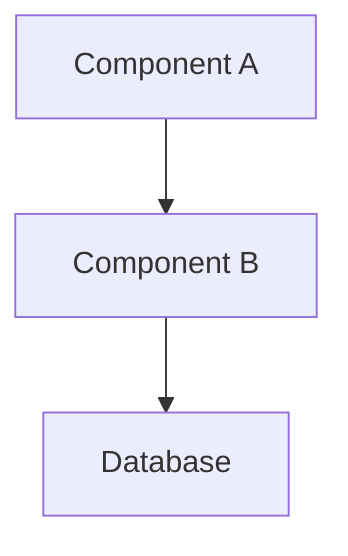
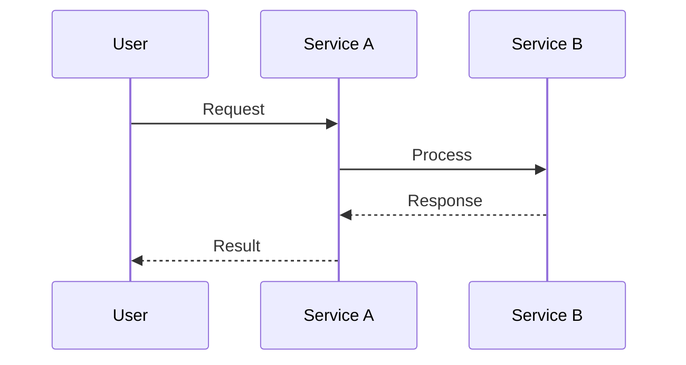
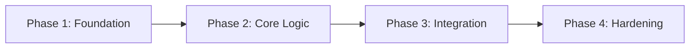

# HLD: [Feature/Change Title]

**Author:** [Name]
**Date:** [Date]
**Status:** Draft | In Review | Approved | Superseded
**Reviewers:** [Names/Teams]

---

## 1. Problem Statement

What problem are we solving? Why now? Include enough context that someone unfamiliar
with the history can understand the motivation. Reference any relevant tickets, incidents,
or customer feedback.

## 2. Goals and Non-Goals

### Goals
- Specific, measurable outcomes this work achieves
- Each goal should be independently verifiable

### Non-Goals
- Things that are explicitly out of scope
- Adjacent concerns that might be confused as in-scope
- "Not right now" items that may come later

## 3. Proposed Solution

### Overview
A 2-3 paragraph summary of the approach. A reader should be able to understand the
core idea from this section alone without reading further.

### Architecture

Describe the system architecture at a component level. Include:
- Major components/services and their responsibilities
- How components communicate (sync/async, protocols, message formats)
- Data flow through the system

Use mermaid diagrams to illustrate:

#### System Architecture Diagram

#### Sequence Diagram (for key flows)

### Data Model

New or modified data entities. Include:
- Entity definitions with key fields and types
- Relationships between entities
- Storage location and access patterns
- Data lifecycle (creation, updates, deletion, archival)

### API Design

For any new or modified APIs:
- Endpoint/method signatures
- Request/response shapes (representative examples, not exhaustive)
- Error cases and how they're communicated
- Versioning/compatibility approach

### Key Design Decisions

For each significant decision, explain:
- What was decided
- Why this approach over alternatives
- What tradeoffs were accepted

This section is critical — it captures the reasoning that would otherwise be lost.
Future engineers reading this need to understand not just what was built, but why.

## 4. Alternatives Considered

For each alternative that was seriously evaluated:
- Brief description of the approach
- Why it was rejected (specific technical or business reasons)
- What it would have been better at (honest acknowledgment of tradeoffs)

## 5. Codebase Impact

### Files to Modify
| File/Module | Change Description |
|---|---|
| `src/component/file.js` | Add new method for X |

### New Files
| File/Module | Purpose |
|---|---|
| `src/new-component/index.js` | Entry point for new feature |

### Files to Remove/Deprecate
| File/Module | Reason |
|---|---|
| `src/old/legacy.js` | Replaced by new implementation |

### Configuration Changes
- Environment variables added/modified
- Feature flags
- Build system changes

### Database/Schema Changes
- New tables, columns, indexes
- Migration strategy

## 6. Security Considerations

- Authentication/authorization implications
- Data sensitivity and handling
- Input validation boundaries
- Threat model changes (new attack surface, if any)

## 7. Performance & Scalability

- Expected load characteristics
- Performance-critical paths and how they're optimized
- Scaling strategy (horizontal/vertical, auto-scaling triggers)
- Resource requirements (compute, memory, storage, network)
- Caching strategy if applicable

## 8. Reliability & Failure Modes

- What can go wrong and how the system handles it
- Degraded operation modes (graceful degradation)
- Data consistency guarantees
- Retry/backoff strategies for external dependencies
- Circuit breaker or bulkhead patterns if applicable

## 9. Observability

- Key metrics to track
- Alerting thresholds
- Logging strategy for debugging
- Distributed tracing considerations

## 10. Migration & Rollout Strategy

- Deployment sequence and dependencies
- Feature flag strategy
- Data migration plan (if applicable)
- Rollback procedure
- Canary/progressive rollout plan

## 11. Testing Strategy

- What new test categories are needed (unit, integration, e2e, performance)
- Key scenarios that must be covered
- Test infrastructure changes

## 12. Open Questions

- Unresolved decisions that need further investigation or stakeholder input
- Items deferred for later design iterations
- Dependencies on external team decisions

## 13. Implementation Phases

Break the work into ordered phases. Each phase should be independently shippable
(or at minimum, safely mergeable) and produce a verifiable result.

### Phase Overview

| Phase | Scope Summary | Depends On | Deliverable |
|-------|---------------|------------|-------------|
| 1. Foundation | Core data model and base infrastructure | — | New entities available, existing tests pass |
| 2. Core Logic | Primary feature implementation | Phase 1 | Feature works end-to-end in dev |
| 3. Integration | Wire into existing system, API surface | Phase 2 | API available, integration tests pass |
| 4. Hardening | Error handling, edge cases, observability | Phase 3 | Production-ready, monitoring in place |

*Adjust the number of phases to match the work. Small features may need 2 phases;
large efforts may need 5-6. Each phase should map to a logical PR or PR group.*

### Phase Dependencies

### Key Sequencing Decisions

- What must be done first and why (e.g., schema migrations before application code)
- What can be parallelized across engineers
- Where feature flags enable merging incomplete work safely
- Rollback boundaries — which phases can be independently reverted

## 14. References

- Related design docs, RFCs, or ADRs
- External documentation (API docs, protocol specs)
- Relevant tickets or epics
