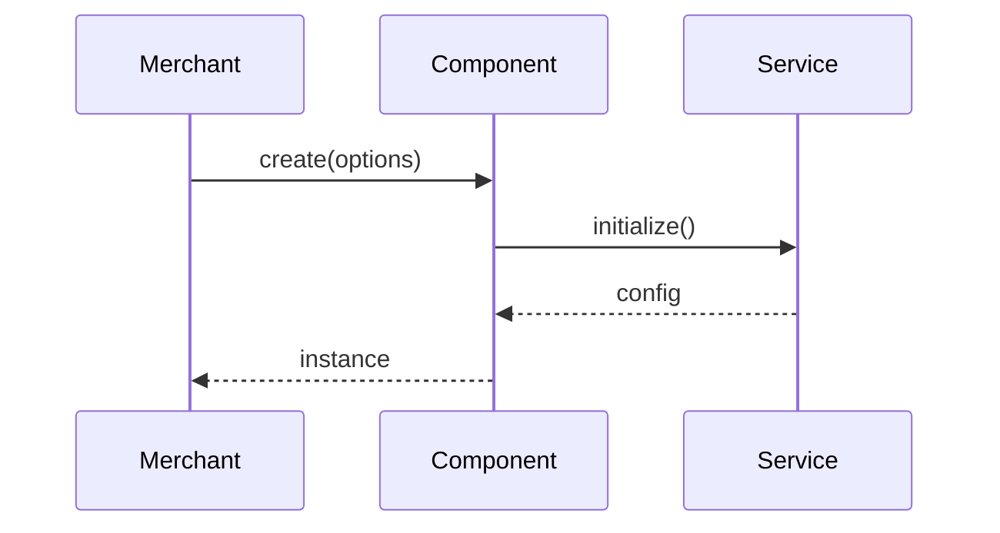
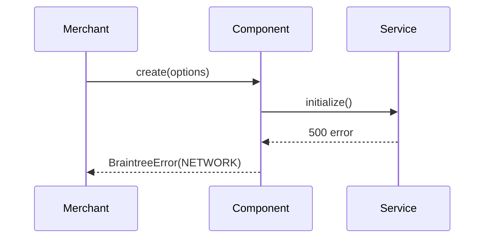
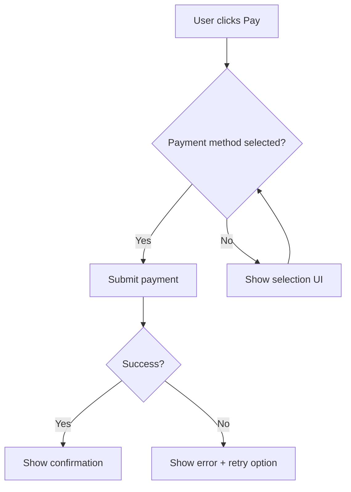
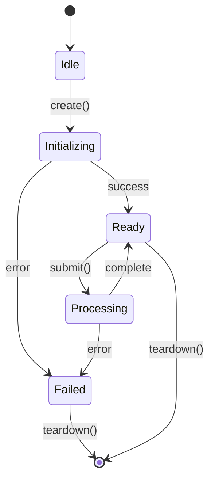

# LLD: [Feature/Change Title]

**HLD Reference:** [path/to/hld.md]
**Author:** [Name]
**Date:** [Date]
**Status:** Draft | In Review | Approved

---

## 1. Scope

One paragraph. What this LLD covers and what it doesn't. Reference the HLD for context, goals, and architectural decisions.

## 2. Component Breakdown

For each component/module introduced or modified:

### [Component Name]

**Location:** `src/path/to/component/`
**Responsibility:** One sentence.

#### Public API

| Method | Parameters | Returns | Description |
|--------|-----------|---------|-------------|
| `create(options)` | `{ client: Client, authorization: string }` | `Promise<Instance>` | Factory method following standard component pattern |

#### Internal Methods

| Method | Parameters | Returns | Description |
|--------|-----------|---------|-------------|
| `_initialize()` | none | `Promise<void>` | Sets up internal state after construction |

#### Dependencies

| Dependency | Type | Purpose |
|-----------|------|---------|
| `src/lib/analytics.js` | Internal | Event tracking |
| `external-sdk` | External | Third-party integration |

## 3. Sequence Diagrams

One mermaid diagram per distinct flow. Split happy path and error path.

### [Flow Name] — Happy Path



### [Flow Name] — Error Path



## 4. User Flow Diagrams

Mermaid flowcharts for user-facing interaction paths.



## 5. State Management

### State Machine Diagram



### State Transition Table

| Current State | Event | Next State | Side Effects |
|--------------|-------|------------|-------------|
| Idle | `create()` | Initializing | Fetch config, send analytics |
| Initializing | success | Ready | Resolve promise |
| Initializing | error | Failed | Reject with BraintreeError |

## 6. Error Handling

### Error Catalog

| Error Code | Type | Trigger Condition | User-Facing Message | Recovery Action |
|-----------|------|-------------------|---------------------|----------------|
| `COMPONENT_NOT_ENABLED` | MERCHANT | Gateway config missing feature | "Component is not enabled for this merchant" | Contact support |
| `NETWORK_TIMEOUT` | NETWORK | Request exceeds timeout | "Request timed out" | Retry |

### Retry Strategy

| Operation | Max Retries | Backoff | Timeout | Circuit Breaker |
|-----------|------------|---------|---------|----------------|
| Config fetch | 3 | Exponential (1s, 2s, 4s) | 10s | After 5 failures in 30s |

## 7. Data Transformations

### [Transformation Name]

**Input Shape:**
```javascript
{
  amount: '10.00',        // string, required
  currency: 'USD',        // string, ISO 4217
  options: {
    submitForSettlement: true  // boolean, optional, default: false
  }
}
```

**Output Shape:**
```javascript
{
  nonce: 'abc-123',       // string, single-use payment token
  type: 'PayPalAccount',  // string, payment method type
  details: {
    email: 'buyer@example.com'  // string, payer email
  }
}
```

**Transformation Logic (pseudocode):**
```
validate input.amount is non-negative decimal string
validate input.currency against supported list
map input fields to API request format
call service
map response to output shape
```

**Edge Cases:**

| Input Condition | Expected Behavior |
|----------------|-------------------|
| `amount = '0.00'` | Allow — valid for authorization |
| `amount = '-1.00'` | Reject with INVALID_AMOUNT error |
| `currency = null` | Default to merchant's configured currency |

## 8. Interface Contracts

Field-level contracts between components that cross boundaries.

### [Component A] -> [Component B]

| Field | Type | Required | Constraints | Default |
|-------|------|----------|------------|---------|
| `merchantId` | string | yes | Non-empty, alphanumeric | — |
| `amount` | string | yes | Decimal format `\d+\.\d{2}` | — |
| `intent` | string | no | `'sale'` or `'authorize'` | `'authorize'` |

## 9. Design Patterns Applied

| Pattern | Location | Rationale |
|---------|----------|-----------|
| Deferred Client | `create()` entry point | Standard braintree.js initialization pattern — allows authorization string or client instance |
| Error Wrapping | All public methods | Consistent BraintreeError types for merchant-facing errors |
| Teardown | `teardown()` | Prevents memory leaks; disables methods post-teardown |

## 10. File-Level Implementation Plan

Ordered for incremental development and review. Each step is independently reviewable as a PR.

| Step | File(s) | Action | Description | Depends On |
|------|---------|--------|-------------|-----------|
| 1 | `src/component/errors.js` | Create | Error code definitions | — |
| 2 | `src/component/constants.js` | Create | Configuration constants | — |
| 3 | `src/component/component.js` | Create | Core implementation | 1, 2 |
| 4 | `src/component/index.js` | Create | Public API entry point | 3 |
| 5 | `test/component/unit/component.js` | Create | Unit tests | 3 |
| 6 | `src/index.js` | Modify | Register component in main SDK | 4 |

## 11. Testing Specifications

### Unit Tests

| Test Case | Method Under Test | Input | Expected Output | Fixture/Mock |
|-----------|------------------|-------|-----------------|-------------|
| Creates instance with valid options | `create()` | `{ client: mockClient }` | Resolves with instance | `mockClient` with valid config |
| Rejects without authorization | `create()` | `{}` | Rejects with INSTANTIATION_OPTION_REQUIRED | — |

### Integration Tests

| Test Case | Flow | Setup | Assertions |
|-----------|------|-------|-----------|
| End-to-end payment | Happy path | Sandbox credentials, test card | Nonce returned, analytics sent |
| Network failure recovery | Error path | Mock network timeout | Error surfaced, retry attempted |

## 12. Assumptions and Open Items

### Assumptions

| # | Assumption | Impact If Wrong |
|---|-----------|----------------|
| 1 | External SDK loads synchronously before our init | Init will fail; need async loader or retry |
| 2 | Gateway config always includes feature flag | Create will throw misleading error; need fallback check |

### Open Items

| # | Question | Owner | Deadline |
|---|---------|-------|---------|
| 1 | Confirm rate limit for external API | Backend team | Before Step 3 |
