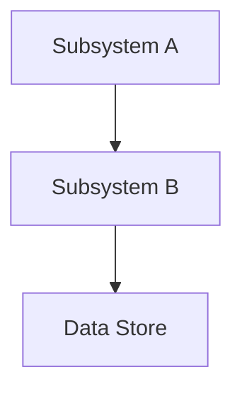

# HLD: [Feature/System Title]

**Bible Source:** [path to bible feature file]
**Pillar Alignment:** [list aligned pillars with one-line quote from each]
**Engine:** [engine name and version]
**Status:** Draft | In Review | Approved
**Reviewers:** [Names/Teams]
**Date:** [date]

---

## 1. Problem Statement

What player-facing problem does this system solve? Why does this game need it?

Reference the bible's description of this feature and connect it to the core loop. Include which design pillars this system serves and how.

## 2. Goals and Non-Goals

### Goals
- Specific, measurable outcomes this system achieves
- Each goal tied to a design pillar or core loop element
- Performance targets where applicable (e.g., "combat resolution in <2ms per frame")

### Non-Goals
- Features explicitly out of scope (reference bible's non-goals where relevant)
- Adjacent systems handled by other HLDs
- "Not in this milestone" items

## 3. Proposed Solution

### Overview
A 2-3 paragraph summary of the technical approach. A reader should understand the core architecture from this section alone.

### System Architecture

Describe the system at a component level:
- Major subsystems and their responsibilities
- How subsystems communicate (events, direct calls, message bus)
- Data flow through the system

*For systems with important temporal ordering (e.g., combat resolution, transaction processing), include a sequence diagram showing the key interaction flow.*

### Data Model

New or modified data entities:
- Entity definitions with key fields and types
- Relationships between entities
- Serialization format (for save/load)
- Hot-path data layout considerations (struct-of-arrays vs array-of-structs)

### Engine Integration

How this system hooks into the game engine:
- **Scene Lifecycle**: When does this system initialize, update, and tear down?
- **Update Loop**: Which engine tick does this run on? (physics, render, fixed, late?)
- **Asset Dependencies**: What assets must be loaded before this system runs?
- **Editor Tooling**: What inspector/debug tools does this system need?
- **Plugin/Module Registration**: How is this system registered with the engine?
- **Scripting/Modding API** *(if applicable)*: If this system exposes callable functions to scripts, blueprints, or mods — document the public API surface and safety boundaries.

### Codebase Touch Points

*Skip this subsection if no codebase exists yet.*

| Module/File | Change Type | Risk | Notes |
|------------|-------------|------|-------|
| [path/to/module] | New / Modify / Extend | Low / Med / High | [what changes and why] |

### Key Design Decisions

For each significant decision:
- What was decided
- Why this approach over alternatives (reference pillar tradeoffs)
- What tradeoffs were accepted

## 4. Alternatives Considered

For each alternative seriously evaluated:
- Brief description of the approach
- Why it was rejected (technical or pillar-alignment reasons)
- What it would have been better at (honest tradeoff acknowledgment)
- **Pillar check**: Did a design pillar rule this out? Quote the relevant "What This Rules Out" item if so.

Minimum 2 alternatives required.

## 5. Asset Pipeline Impact

What assets does this system require?

| Asset Type | Count Estimate | Format | Source | Build Step |
|-----------|---------------|--------|--------|------------|
| Textures | | .png/.tga | Art team | Atlas packer |
| Audio | | .wav/.ogg | Sound team | Wwise/FMOD |
| Animations | | .fbx/.anim | Art team | Retarget + compress |
| Data Files | | .json/.csv | Design team | Validation pass |
| Shaders | | .hlsl/.glsl | Tech art | Compile + variant |
| UI Assets | | .png/.svg | UI team | Atlas packer |

### Asset Budget
- Total estimated disk size for this system's assets
- Memory budget at runtime
- Streaming requirements (what loads on-demand vs. preloaded?)

## 6. Multiplayer / Networking

*Skip this section if the game has no multiplayer component.*

- **Authority Model**: Client-authoritative, server-authoritative, or hybrid? For which operations?
- **State Sync**: What state does this system replicate? How often?
- **Bandwidth Budget**: Estimated KB/s for this system's network traffic
- **Lag Compensation**: How does this system handle latency? (input prediction, rollback, interpolation)
- **Cheat Prevention**: What exploits could target this system? What server-side validation is needed?

## 7. Platform Considerations

*Skip this section if targeting a single platform with no constraints.*

| Consideration | PC | Console | Mobile | Web |
|--------------|-----|---------|--------|-----|
| Input Method | | | | |
| Performance Target | | | | |
| Memory Budget | | | | |
| Storage Impact | | | | |
| Platform-Specific APIs | | | | |

Note any platform-specific implementations or graceful degradation strategies.

## 8. Performance Budget

Frame-time-oriented performance targets:

| Metric | Budget | Measurement Method |
|--------|--------|--------------------|
| CPU time per frame | ms | Profiler marker |
| Memory (runtime) | MB | Allocation tracker |
| Draw calls | count | GPU profiler |
| Triangles | count | GPU profiler |
| Network bandwidth | KB/s | NetStats |
| Load time contribution | ms | Boot profiler |
| Asset memory (VRAM) | MB | GPU memory tracker |

### Hot Paths
Identify the performance-critical code paths and how they're optimized:
- What runs every frame?
- What can be amortized across frames?
- What can run async or on a worker thread?

### Scalability
How does this system degrade gracefully under load?
- LOD strategies
- Culling/spatial partitioning
- Quality settings that affect this system

## 9. Reliability & Edge Cases

- **Save/Load Integrity**: How is this system's state serialized? What happens on version mismatch?
- **Scene Transitions**: How does this system handle level loading, fast travel, respawn?
- **Exploit Vectors**: What can players abuse? (duplication glitches, speed exploits, memory manipulation)
- **Failure Recovery**: What happens when this system encounters invalid state?
- **Edge Cases**: Enumerate known edge cases and how each is handled
- **Data Security** *(online features only)*: Encryption at rest/in transit, server-side validation requirements, PII data flows and compliance considerations

## 10. Testing Strategy

- **Unit Tests**: Core logic testable in isolation (no engine dependency)
- **Integration Tests**: System interactions with engine and other systems
- **Automated Gameplay Tests**: Bot/replay-driven tests for this system's core scenarios
- **Playtest Criteria**: What should QA specifically test? What "feels wrong" signals to watch for?
- **Performance Tests**: Benchmarks and regression thresholds
- **Platform-Specific Tests**: Any platform-particular test requirements

### Debug & Telemetry
- **Runtime Logging**: What this system logs, at what verbosity levels
- **Analytics Events**: Gameplay events this system emits for analytics/telemetry
- **Debug Tooling**: Cheat menus, console commands, or visualization overlays for development

## 11. Open Questions

- [ ] Unresolved decisions needing further investigation or stakeholder input
- [ ] Dependencies on other systems not yet designed
- [ ] Performance unknowns requiring prototyping
- [ ] Items deferred for later design iterations

## 12. Implementation Phases

| Phase | Scope | Depends On | Deliverable | Playable? |
|-------|-------|------------|-------------|-----------|
| 1. Greybox | Core mechanic, placeholder assets | — | Mechanic testable in isolation | Greybox prototype |
| 2. Polish | Real assets, juice, feel | Phase 1 | Feature feels good | Polished standalone |
| 3. Integrate | Wire into game systems, UI, save/load | Phase 2 | Works in full game context | Integrated |
| 4. Ship | Edge cases, perf, platform compliance | Phase 3 | Release-ready | Shippable |

*Adjust phase count to match complexity. Simple features may need 2 phases; complex systems may need 5-6. The "Playable?" column tracks the milestone quality level at each phase.*

### Save Data Compatibility
- **Save format versioning**: How is this system's save data versioned?
- **Backwards compatibility**: Can newer code load older save files? What migration strategy?
- **Schema changes**: How are field additions/removals/renames handled across versions?

### Key Sequencing Decisions
- What must be built sequentially (hard dependencies)?
- What can be built in parallel?
- Rollback boundaries — where can you revert without cascading?

## 13. Cross-References

- **Bible Source**: See header
- **Design Pillars**: [link to DESIGN-PILLARS.md]
- **Core Loop**: [link to core-loop.md]
- **Related HLDs**: [links to sibling HLDs that interact with this system]
- **Related Bible Sections**: [links to other bible sections that inform this design]
- **LLD** (if generated): [link to LLD document]
